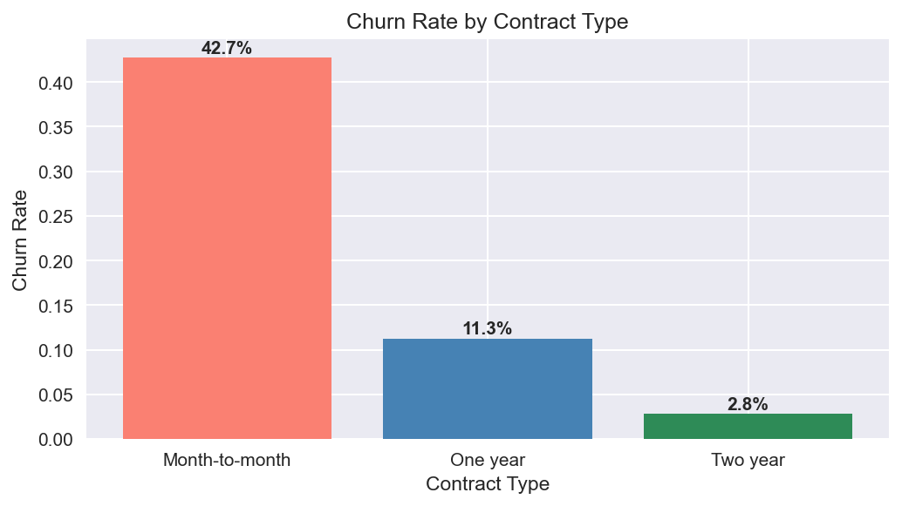
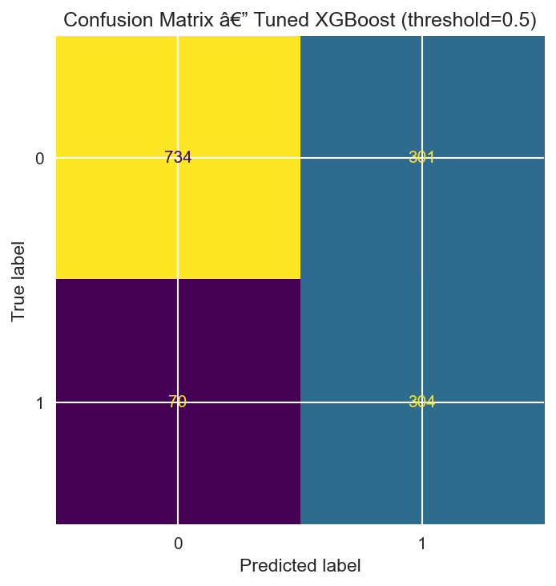
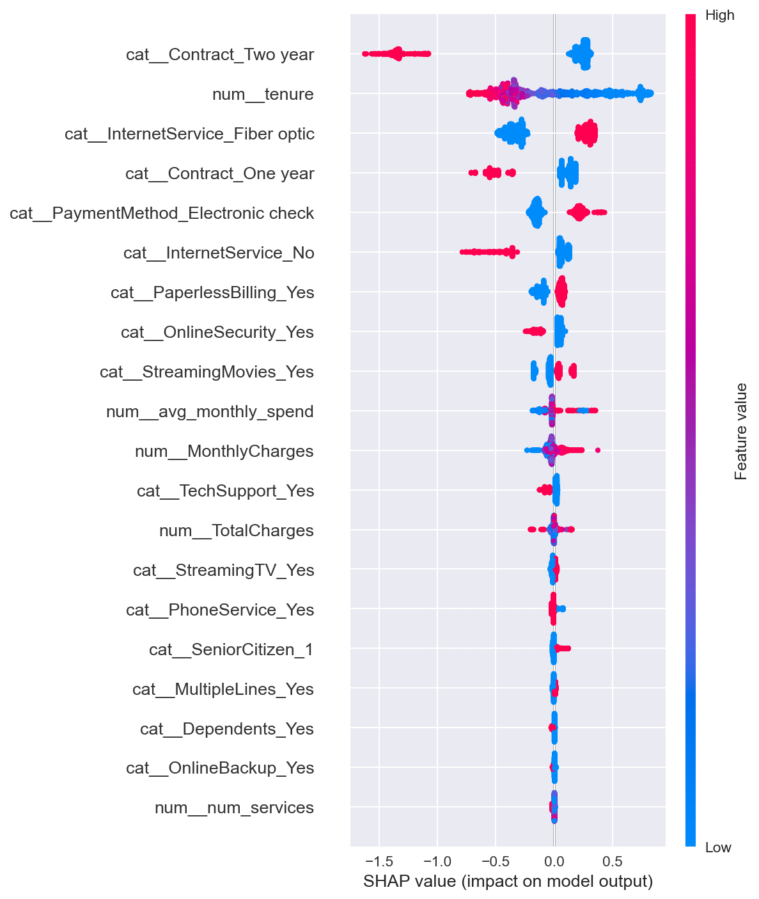

# Telco Customer Churn Prediction

An end-to-end ML pipeline that predicts whether a telecom customer will churn — covering EDA, feature engineering, XGBoost modeling, SHAP interpretability, and a FastAPI deployment with Docker.

---

## Problem Statement

Telecom companies lose significant revenue when customers leave (churn). This project builds a production-grade churn prediction system on the IBM Telco Customer Churn dataset (~7,000 customers). The goal is not just a high-accuracy model, but an interpretable, deployable pipeline that a business can act on: identify at-risk customers early, understand *why* they're at risk, and trigger targeted retention campaigns.

---

## Results

| Model | Precision (Churn) | Recall (Churn) | F1 (Churn) | ROC-AUC |
|---|---|---|---|---|
| Logistic Regression (baseline) | 0.50 | 0.78 | 0.61 | 0.8456 |
| Random Forest | 0.63 | 0.49 | 0.55 | 0.8228 |
| XGBoost (default) | 0.53 | 0.65 | 0.58 | 0.8217 |
| **XGBoost (tuned, threshold=0.35)** | **0.43** | **0.90** | **0.58** | **0.8424** |

Best GridSearchCV params: `max_depth=3, n_estimators=300, learning_rate=0.01` (optimised for F1).
Deployed threshold: **0.35** — maximises recall (0.90) at the cost of precision, matching the business case where missed churners are costlier than false alarms.

---

## Key Findings

### Churn by Contract Type


Month-to-month customers churn at ~3× the rate of two-year contract customers.

### Confusion Matrix


### SHAP Feature Importance


---

## Business Insight

**Month-to-month contract, tenure < 12 months, and absence of tech support are the three strongest churn signals.** High MonthlyCharges amplifies risk, while longer tenure and two-year contracts are strong retention indicators. Customers who bundle more services show lower churn probability — cross-selling reduces attrition risk.

We use a **classification threshold of 0.35** (instead of the default 0.5) because a missed churner costs more than a wasted retention offer. This prioritises recall on the churn class at a modest precision trade-off.

---

## Project Structure

```
telco-churn-prediction/
├── data/
│   └── telco_churn.csv          # Download from Kaggle (see Setup)
├── notebooks/
│   └── 01_eda_modeling.ipynb    # Full EDA → modeling → SHAP pipeline
├── src/
│   ├── preprocessing.py         # load_and_clean() + build_pipeline()
│   ├── features.py              # add_features() — 4 engineered features
│   ├── train.py                 # Trains and saves models/churn_pipeline.pkl
│   └── api.py                   # FastAPI prediction service
├── models/
│   └── churn_pipeline.pkl       # Saved after running train.py
├── Dockerfile
├── requirements.txt
└── README.md
```

---

## Setup & How to Run

### 1. Get the Dataset

Download **Telco Customer Churn** from Kaggle (IBM/WA_Fn-UseC_ version):
```
https://www.kaggle.com/datasets/blastchar/telco-customer-churn
```
Place the CSV at `data/telco_churn.csv`.

### 2. Install Dependencies

```bash
pip install -r requirements.txt
```

### 3. Run the Notebook (EDA + Modeling)

```bash
jupyter notebook notebooks/01_eda_modeling.ipynb
```

Run all cells top-to-bottom. The final cell saves `models/churn_pipeline.pkl`.

### 4. Train via Script (alternative to notebook)

```bash
python src/train.py
```

### 5. Run the API locally

```bash
uvicorn src.api:app --host 0.0.0.0 --port 8000
```

### 6. Run with Docker

```bash
docker build -t telco-churn .
docker run -p 8000:8000 telco-churn
```

The Docker build runs `train.py` automatically — no need to provide a pre-trained model.

---

## API Usage

### Health Check
```bash
curl http://localhost:8000/health
# {"status":"ok"}
```

### Predict Churn
```bash
curl -X POST http://localhost:8000/predict \
  -H "Content-Type: application/json" \
  -d '{
    "tenure": 2,
    "MonthlyCharges": 70.0,
    "TotalCharges": 140.0,
    "gender": "Male",
    "SeniorCitizen": 0,
    "Partner": "No",
    "Dependents": "No",
    "PhoneService": "Yes",
    "MultipleLines": "No",
    "InternetService": "Fiber optic",
    "OnlineSecurity": "No",
    "OnlineBackup": "No",
    "DeviceProtection": "No",
    "TechSupport": "No",
    "StreamingTV": "No",
    "StreamingMovies": "No",
    "Contract": "Month-to-month",
    "PaperlessBilling": "Yes",
    "PaymentMethod": "Electronic check"
  }'
# {"churn_probability": 0.847, "churn_prediction": "Yes"}
```

---

## Engineered Features

| Feature | Description | Rationale |
|---|---|---|
| `tenure_bucket` | Tenure binned: 0-12, 13-24, 25-48, 49+ months | Churn risk is non-linear with tenure |
| `num_services` | Count of 6 optional services subscribed | More services = more "locked in" |
| `avg_monthly_spend` | TotalCharges / (tenure + 1) | Flags pricing anomalies vs. current spend |
| `has_streaming` | 1 if StreamingTV or StreamingMovies = Yes | Simplifies two correlated columns |

---

## Tech Stack

- **Modeling**: scikit-learn, XGBoost, imbalanced-learn (SMOTE)
- **Interpretability**: SHAP
- **API**: FastAPI + Uvicorn
- **Serialization**: joblib
- **Container**: Docker (python:3.10-slim)
